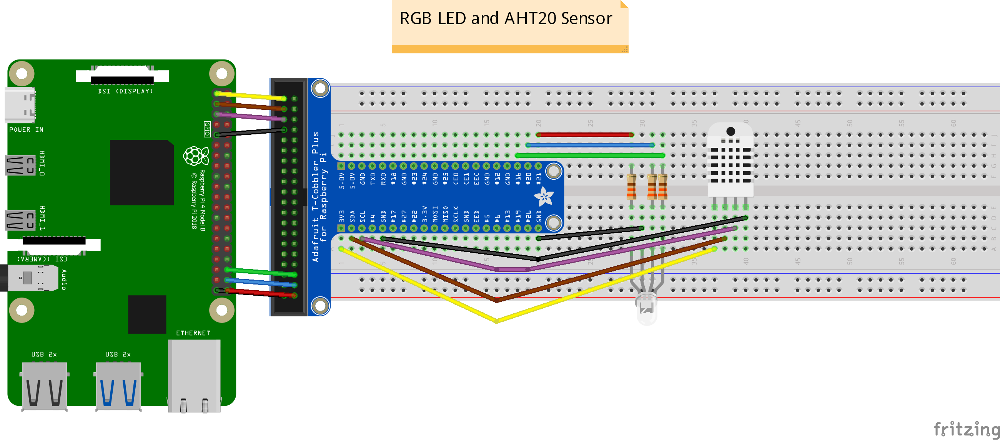
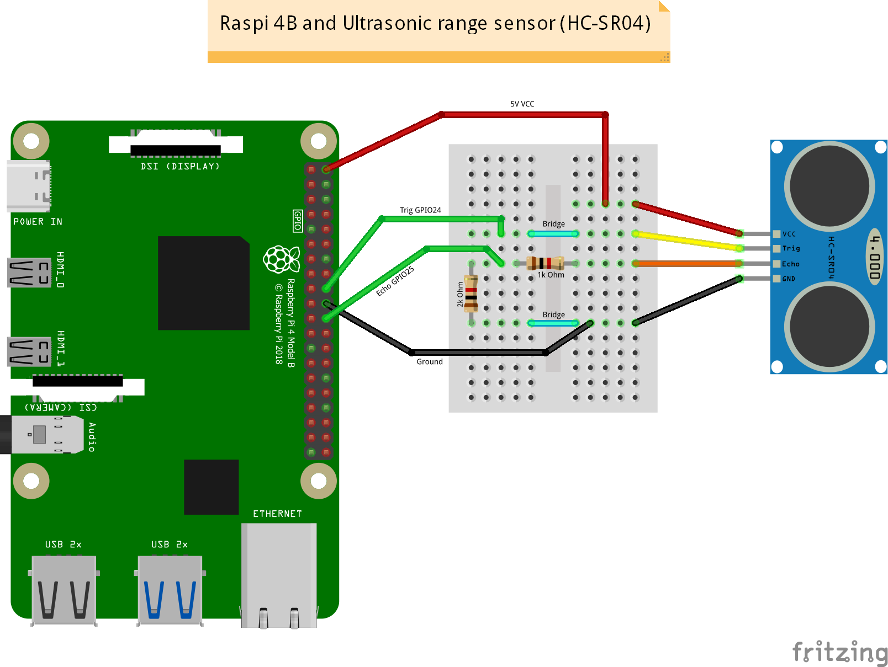
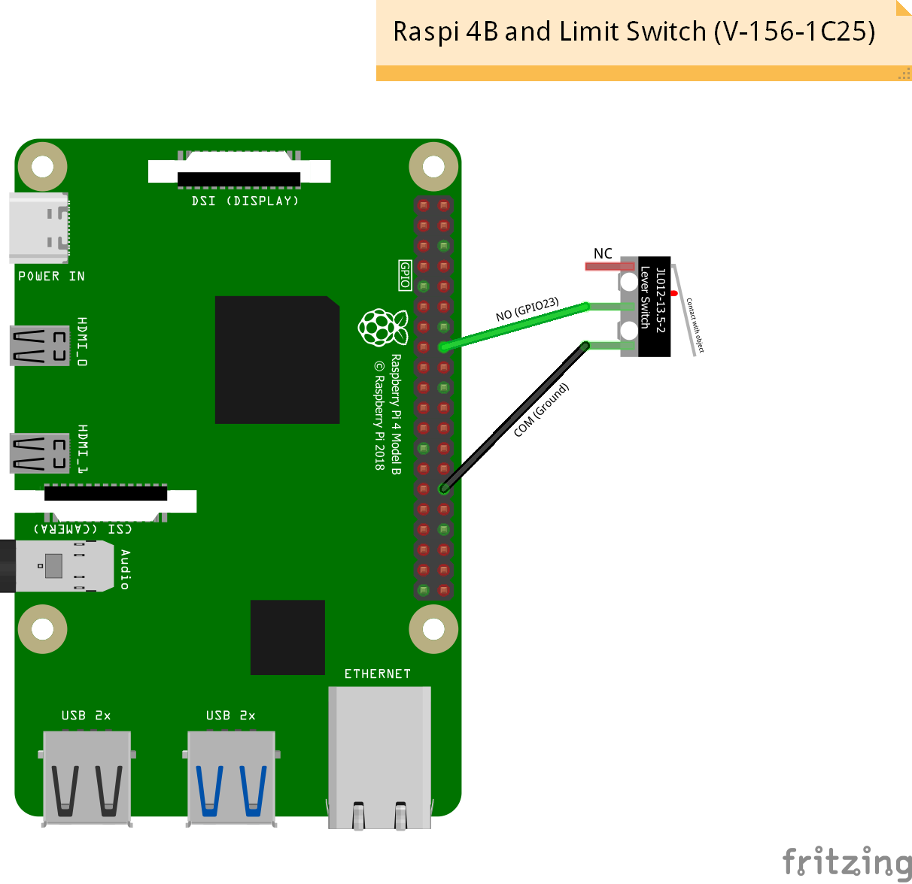
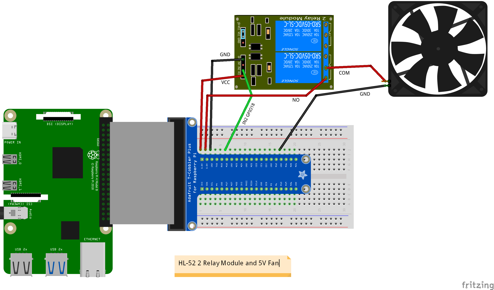

# Szakdolgozat Raspberry Pi(Hardware) part

## RGB LED and AHT20 wiring

> [!NOTE]
> Required hardware

- Raspberry Pi 4 model B
- Breadboard
- Adafruit T-Cobbler
- 3x Resistor 330R
- 1x RGB LED 
- 1x Adafruit AHT20 Temperature and Humidity Sensor
- 8x Male-Male Wire

## Ultrasonic Range Sensor wiring

> [!NOTE]
> Required hardware

- Raspberry Pi 4 model B
- Breadboard
- 1x 1k Ohm Resistor
- 1x 2k Ohm Resistor
- 1x HC-SR04 Ultrasonic Range Sensor
- 4x Male-Female Wire
- 4x Male-Male Wire
- 2x Jumper(bridge) Wire

## Limit Switch wiring

> [!NOTE]
> Required hardware

- Raspberry Pi 4 model B
- 1x V-156-1C25 Limit Switch
- 2x Male-Female Wire

## Fan with Relay wiring

> [!NOTE]
> Required hardware

- Raspberry Pi 4 model B
- Breadboard
- Adafruit T-Cobbler (optional, connect directly to ras-pi)
- 1x 5V Fan
- 1x Relay (2 relay module, HL-52)
- 6x Male-Male wire

