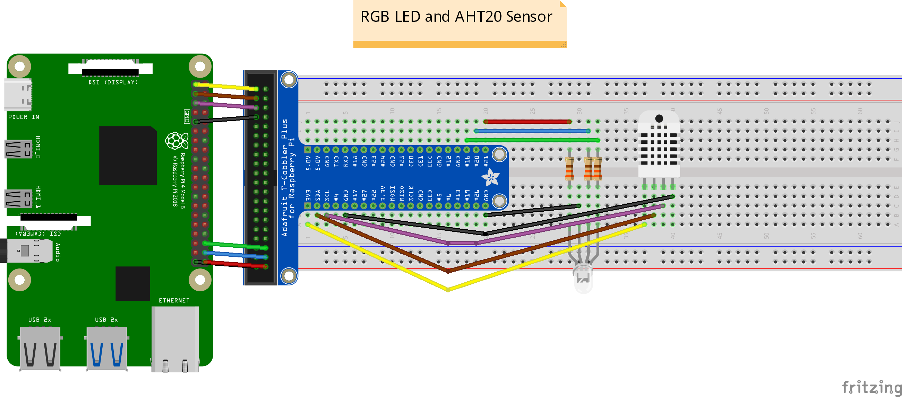
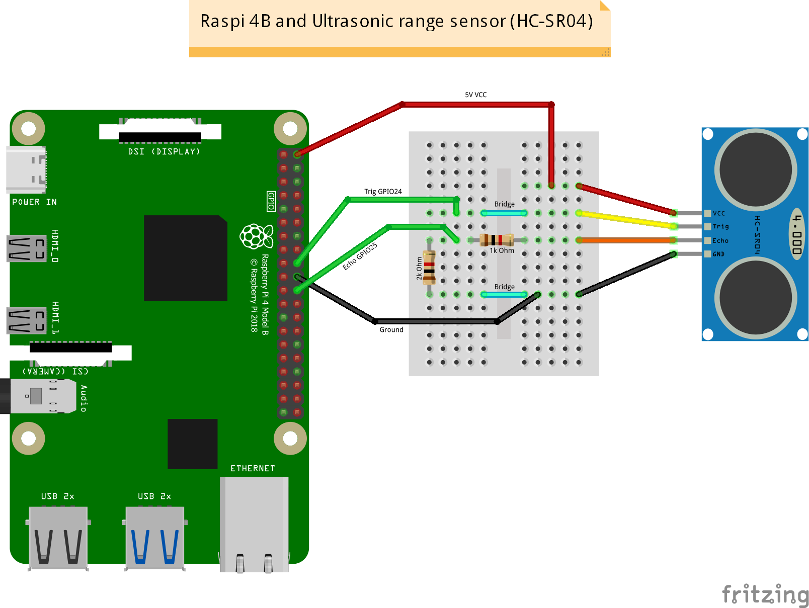
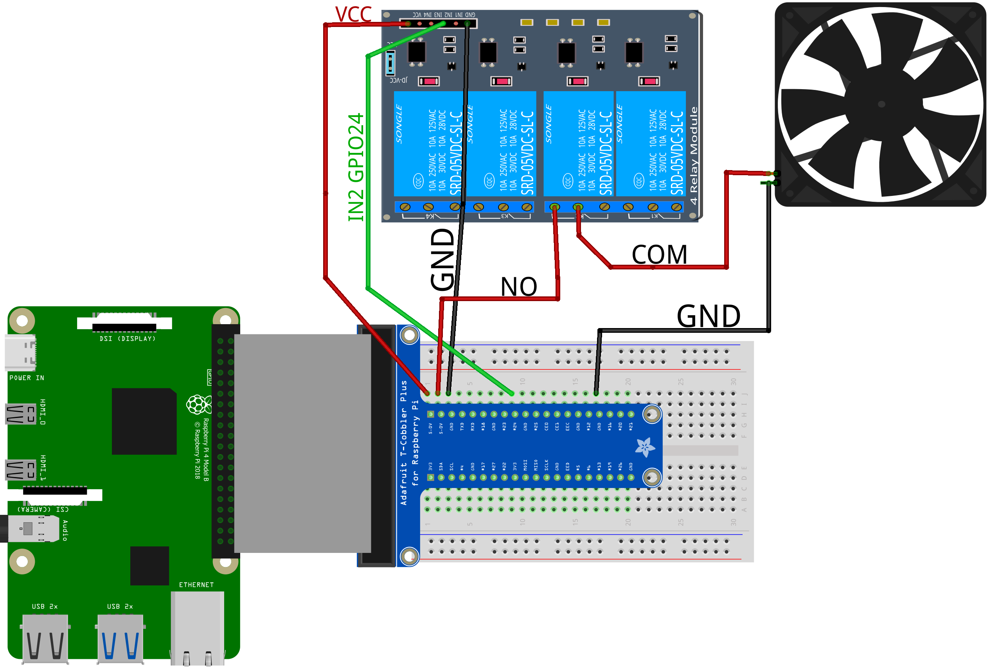
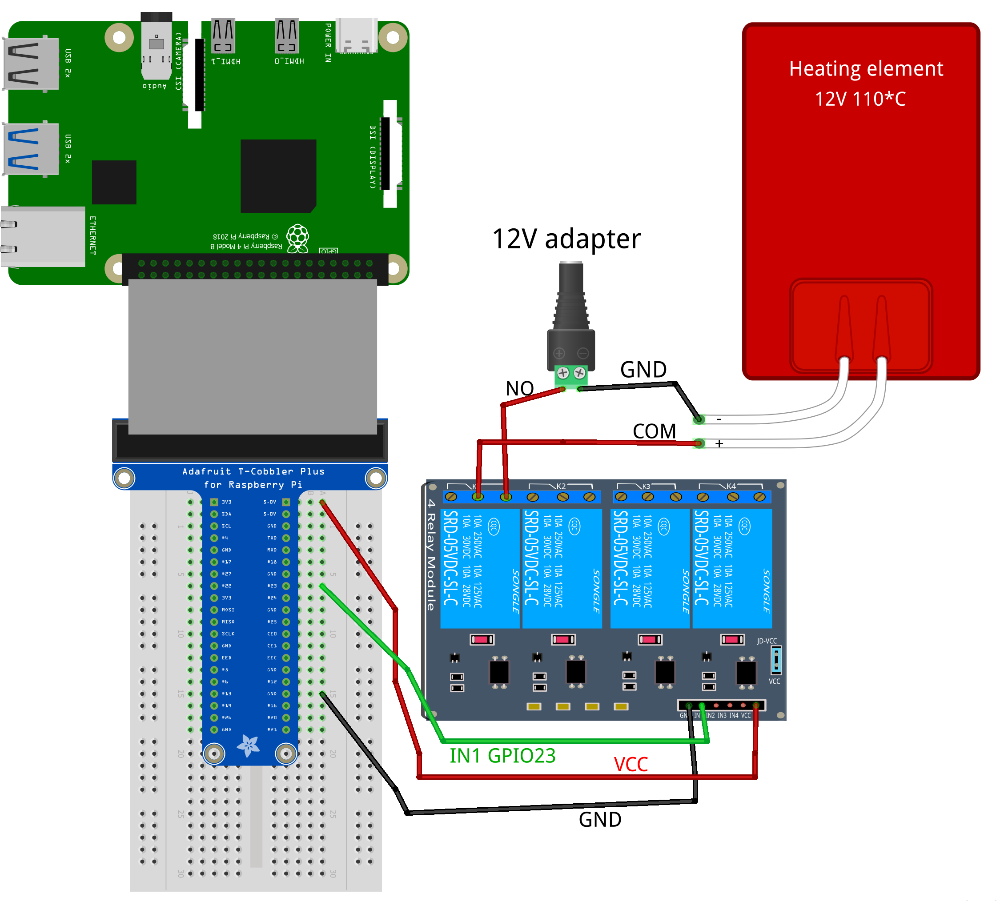

# Szakdolgozat Raspberry Pi(Hardware) part

# Hatching started at 2025-02-21 18:07:59

## https://hippo-immense-plainly.ngrok-free.app/
## https://willing-just-penguin.ngrok-free.app/
## https://lenient-moving-killdeer.ngrok-free.app/

> [!IMPORTANT]
> LED Color Code

- Lid open: red
- Heating element on: green
- Cooler on: White
- Humidifier on: blue
- DC motor on: yellow
- Raspi on: cold white
- Other: -

# Hardware Wiring
> [!WARNING]
> Outdated version!

## RGB LED and AHT20 wiring

> [!NOTE]
> Required hardware

- Raspberry Pi 4 model B
- Breadboard
- Adafruit T-Cobbler
- 3x Resistor 330R
- 1x RGB LED 
- 1x Adafruit AHT20 Temperature and Humidity Sensor
- 8x Male-Male Wire

[//]: # (## Ultrasonic Range Sensor wiring)

[//]: # ()
[//]: # (> [!NOTE])

[//]: # (> Required hardware)

[//]: # ()
[//]: # (- Raspberry Pi 4 model B)

[//]: # (- Breadboard)

[//]: # (- 1x 1k Ohm Resistor)

[//]: # (- 1x 2k Ohm Resistor)

[//]: # (- 1x HC-SR04 Ultrasonic Range Sensor)

[//]: # (- 4x Male-Female Wire)

[//]: # (- 4x Male-Male Wire)

[//]: # (- 2x Jumper&#40;bridge&#41; Wire)

[//]: # ()
[//]: # ()

## Limit Switch wiring

> [!NOTE]
> Required hardware

- Raspberry Pi 4 model B
- 1x V-156-1C25 Limit Switch
- 2x Male-Female Wire

## Fan with Relay wiring

> [!NOTE]
> Required hardware

- Raspberry Pi 4 model B
- Breadboard
- Adafruit T-Cobbler (or, connect directly to ras-pi)
- 1x 5V Fan
- 1x Relay (2 relay module, HL-52)
- 6x Male-Male wire

## Heating Element with Relay wiring

> [!NOTE]
> Required hardware

- Raspberry Pi 4 model B
- Breadboard
- Adafruit T-Cobbler (or, connect directly to ras-pi)
- 1x Heating Element (12V, 110℃)
- 1x 12V Adapter (12V*2A)
- 1x Relay (2 relay module, HL-52)
- 4x Male-Male wire

