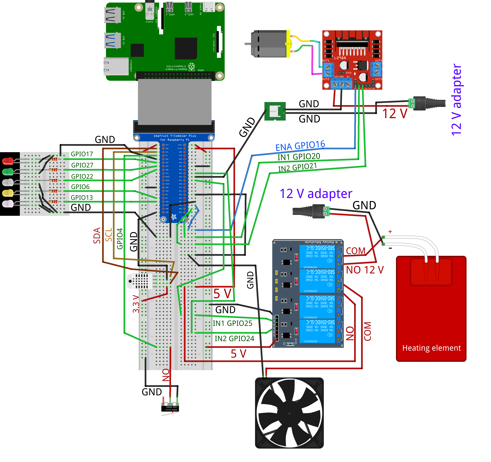
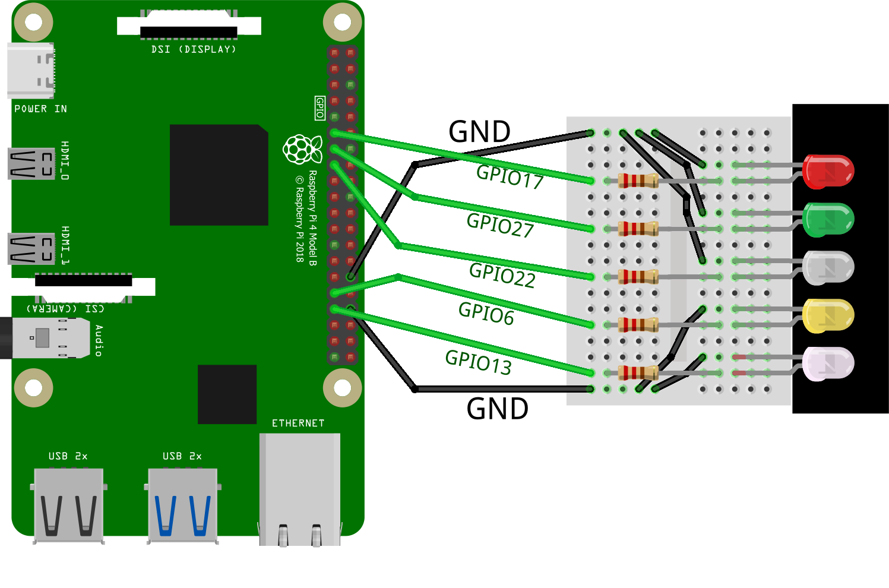

# Szakdolgozat Raspberry Pi(Hardware) part

> [!IMPORTANT]
>  - First Hatching started at 2025-02-21 18:07:59 
>  - Hatching ended at 2025-03-15 15:30:16
>  - Result: 0 kikelés

> [!IMPORTANT]
>  - Second Hatching started at 2025-03-24 17:46:28
>  - Hatching ended at 2025-04-15 10:55:33
>  - Result: 0 kikelés, 2 viszont fejlődött

> [!IMPORTANT]
> LED Color Code

- Lid open: red
- Heating element on: green
- Cooler on: white
- DC motor on: yellow
- Raspi on: cold white
- Other: -

# Preparing

# Hardware Wiring

## All Hardware

## Hardware with Relay

## AHT20 wiring

> [!NOTE]
> Required hardware

- Raspberry Pi 4 model B
- Breadboard
- Adafruit T-Cobbler
- 1x Adafruit AHT20 Temperature and Humidity Sensor
- 4x Male-Male Wire

## Limit Switch wiring

> [!NOTE]
> Required hardware

- Raspberry Pi 4 model B
- 1x V-156-1C25 Limit Switch
- 2x Male-Female Wire

## Fan with Relay wiring

> [!NOTE]
> Required hardware

- Raspberry Pi 4 model B
- Breadboard
- Adafruit T-Cobbler (or, connect directly to ras-pi)
- 1x 5V Fan
- 1x Relay (4 relay module)
- 6x Male-Male wire

## Heating Element with Relay wiring

> [!NOTE]
> Required hardware

- Raspberry Pi 4 model B
- Breadboard
- Adafruit T-Cobbler (or, connect directly to ras-pi)
- 1x Heating Element (12V, 110℃)
- 1x 12V Adapter (12V*2A)
- 1x Relay (4 relay module)
- 4x Male-Male Wire

## DC Engine wiring

> [!NOTE]
> Required hardware

- Raspberry Pi 4 model B
- Breadboard
- Adafruit T-Cobbler (or, connect directly to ras-pi)
- 1x DC Engine (12V, 75RPM)
- 1x 12V Adapter (12V*1A)
- 1x L298N Dual H-Bridge Motor Driver
- 8x Wire

## LED Panel wiring

> [!NOTE]
> Required hardware

- Raspberry Pi 4 model B
- Breadboard
- Adafruit T-Cobbler (or, connect directly to ras-pi)
- 5 LED (Red, Green, White, Yellow, Cold White)
- 7x Wire

